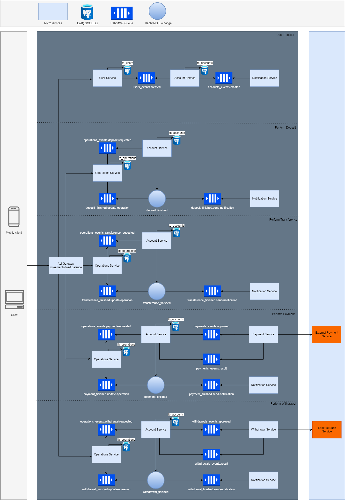

# Desafio Técnico Software Engineer

## Descrição
Desenvolva uma solução Web Backend para servir um aplicativo de carteira digital (Wallet), onde os usuários deste aplicativo realizam operações financeiras básicas como: transferência de valores entre usuário, saque, depósito e pagamento de contas. Considere que essa é uma solução baseada em microservice.

Algumas pré-requisitos:
- Deverá ser considerado uma timeline com as movimentações financeiras que ocorreram na conta do usuário;
- Deverá implementar no mínimo uma comunicação assíncrona;
- Deverá ser desenvolvido os testes unitários do projeto;
- Será um diferencial o desenvolvimento de testes integrados;
- A aplicação deverá ser uma aplicação Web API REST;
- Deverá possuir persistência de dados;
- Deverá ser distribuída como container Docker;
- Será um diferencial a criação do desenho de arquitetura da solução considerando integração com um aplicativo Mobile e um aplicativo Web (incluir no README do projeto);
- Deverá ser disponibilizado em uma repositório Git como GitHub ou Bitbucket;
- Deverá conter um README.md com as instruções para executar o projeto localmente.
- Poderá ser utilizado as seguintes linguagens de programação: Java, Kotlin, GoLang.

## Tecnologias
- [Java 17](https://www.java.com/pt-BR/)     | Linguagem de programação
- [Spring](https://spring.io/why-spring)     | Framework 
- [PostgreSQL](https://www.postgresql.org/)  | SGBD
- [RabbitMQ](https://www.rabbitmq.com/)      | Message broker
- [JUnit](https://junit.org/junit5/)         | Framework para criação de testes unitários
- [Docker](https://www.docker.com/)          | Virtualização de ambientes

## Instalação e execução
1. Faça o clone do projeto
    ```
    git clone https://github.com/vitorsilva98/desafio-software-engineer.git
    ```
2. Na pasta do projeto, execute o comando (Obs: É necessário ter o docker instalado)
    ```
    docker-compose up
    ```

#### Importe o arquivo ".files/wallet-api.postman_collection.json" no Postman para realizar as requisições

## Desenho da solução
